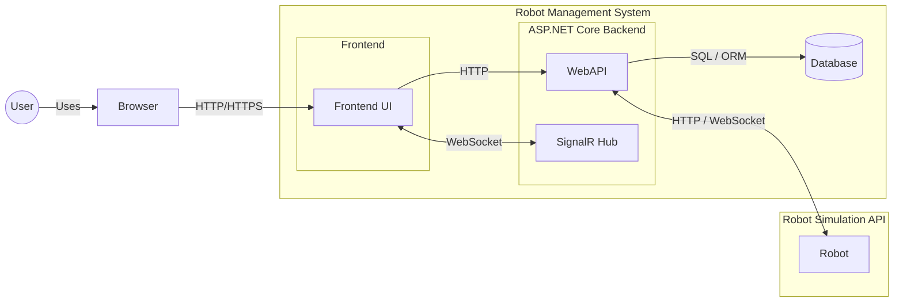

# Ground Control Station (GCS)

# Feature list
- Web-based ground control station dashboard
- 2D grid map on dashboard (21x21) showing robots estimated X and Y position
- Connectivity handling using WebSockets that connect to the robot API (with failure and reconnection handling)
- Enables commanders to move and reset the simulation
- User authentication (login/registration) and role-based access control (RBAC) for security
- Admin user management (delete users and change roles)
- Secured endpoints using Json Web Tokens with a short 15 minute expiry
- SQLite database persistence with Entity Framework Core 
- User session monitoring that notifies users before session expires before they are redirected to login
- Full keyboard-only support with clear outlines (WCAG 2.0 operable principle success criteria 2.1.1 Keyboard, 2.4.7 Focus Visible)
- Light and dark modes for users (WCAG 2.0 percivable principle, guideline 1.4 distinguisable, success criterion 1.4.3 Contrast (Minimum))
- Mission logs that contain information for audit trailing
- Retries are attempted and errors are handled gracefully without crashing any component of the applicaiton
- Multiple user connectivity using SignalR Hub (WebSocket connectivity)
- Docker setup using docker compose
- CI pipeline for build and test verification (integration and unit tests)
- WebSocket connectivity that enable multiple users
- Robot API status monitoring, snapshots and persited logging
- Full automated test suite containing a total of 45 unit/integration tests

## High-Level System Component Diagram

## Setup Instructions

1. Start Docker Desktop / Docker Daemon
2. Run 'docker compose up' in Command Line (Windows) or Terminal (macOS) to start the Docker Container
3. Navigate to the frontend at http://localhost:5116/
4. Log in to root admin using: 'admin' password: 'password'
5. Verify that map and robot telemetry loads, it should look like this:

This confirms that the frontend is communicating with the backend services correctly.

## Test API using Swagger UI
- After running the previous setup instructions, navigate to http://localhost:5085/
- See [PR #33](https://github.com/andreas-nordboe/CMP9134_final_project/pull/33)  for more detailed information 

## Run unit and integration tests manually locally:
This requires .NET 10, however, test have already been run in the CI/CD pipeline.

Dependency required for local manual testing: [Download Microsoft .NET 10](https://dotnet.microsoft.com/en-us/download/dotnet/10.0)

1. Clone this repository
2. `cd` into the source code folder
3. run `dotnet test`
4. Vefiy that all 45 tests pass;

