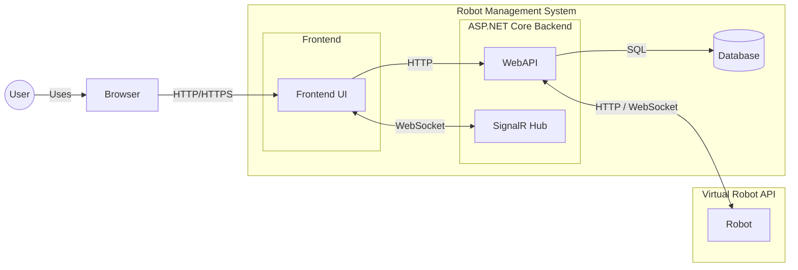

This readme file is currently a placeholder.

## High-level System Component Diagram

```mermaid
flowchart LR

User((User)) --> |Uses| Browser[Browser]

 
 subgraph RobotSystem["Robot Management System"]
 subgraph Backend["ASP.NET Core Backend"]
        API["WebAPI"]
        Hub["SignalR Hub"]
  end  
 subgraph Frontend["Frontend"]
    UI["Frontend UI"]
  end
   DB[("Database")]
  end
  subgraph RobotContainer["Virtual Robot API"]
        Robot["Robot"]
  end

    Browser --> |HTTP/HTTPS| UI
    UI -->|HTTP| API
    UI <--> |WebSocket|Hub
    API --> |SQL| DB
    API <--> |HTTP / WebSocket| Robot
```