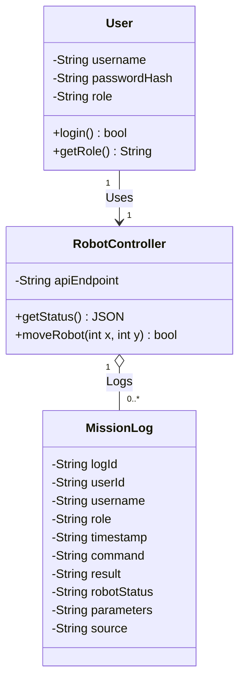

```mermaid
classDiagram
class User {
-String username
-String passwordHash
-String role
+login() bool
+getRole() String
}

class RobotController {
-String apiEndpoint
+getStatus() JSON
+moveRobot(int x, int y) bool
}

class MissionLog { 
-String logId 
-String userId 
-String username 
-String role 
-String timestamp 
-String command 
-String result 
-String robotStatus 
-String parameters 
-String source 
}

User "1" --> "1" RobotController : Uses
%% 0..* means that one robot controller can store multiple MissionLog entries 
RobotController "1" o-- "0..*" MissionLog : Logs
```