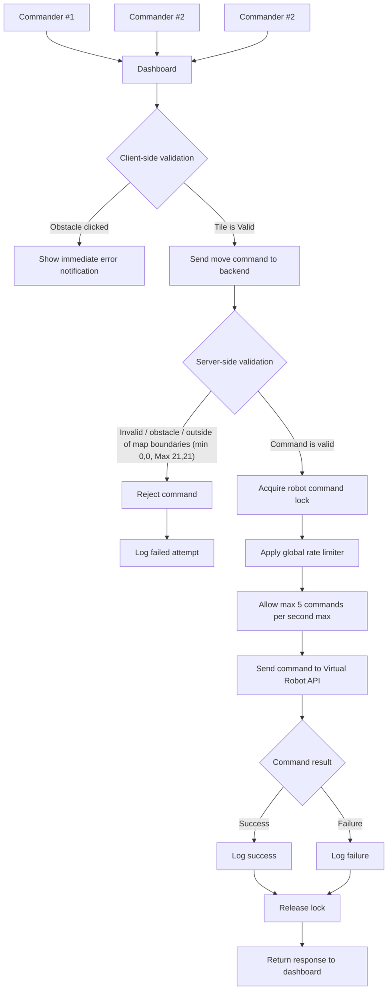

```mermaid
flowchart TD
    C1[Commander #1] --> UI[Dashboard]
    C2[Commander #2] --> UI
    C3[Commander #2] --> UI

    UI --> CV{Client-side validation}
    CV -- Obstacle clicked --> CE[Show immediate error notification]
    CV -- Tile is Valid --> API[Send move command to backend]

    API --> SV{Server-side validation}
    SV -- Invalid / obstacle / outside of map boundaries (min 0,0, Max 21,21) --> RJ[Reject command]
    RJ --> LF[Log failed attempt]

    SV -- Command is valid --> LOCK[Acquire robot command lock]
    LOCK --> RL[Apply global rate limiter]
    RL --> WAIT[Allow max 5 commands per second max]
    WAIT --> SIM[Send command to Virtual Robot API]

    SIM --> RES{Command result}
    RES -- Success --> LS[Log success]
    RES -- Failure --> LFail[Log failure]

    LS --> REL[Release lock]
    LFail --> REL
    REL --> DONE[Return response to dashboard]

```