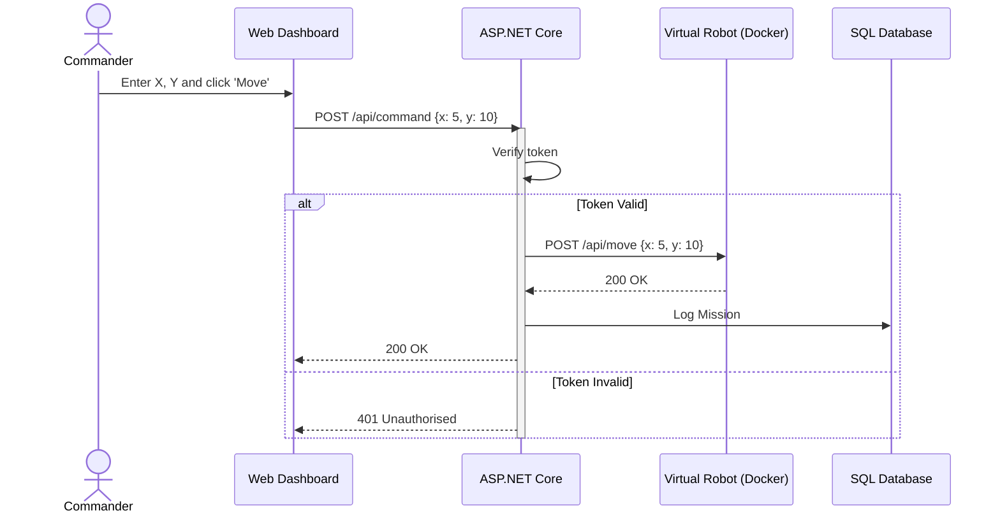

```mermaid
sequenceDiagram
  actor C as Commander
  participant UI as Web Dashboard
  participant API as ASP.NET Core
  participant Sim as Virtual Robot (Docker)
  participant Database as SQL Database
C->>UI: Enter X, Y and click 'Move'
UI->>API: POST /api/command {x: 5, y: 10}
activate API

API->>API: Verify token
alt Token Valid
API->>Sim: POST /api/move {x: 5, y: 10}
Sim-->>API: 200 OK
API->>Database: Log Mission
API-->>UI: 200 OK
else Token Invalid
API-->>UI: 401 Unauthorised
end

deactivate API
```